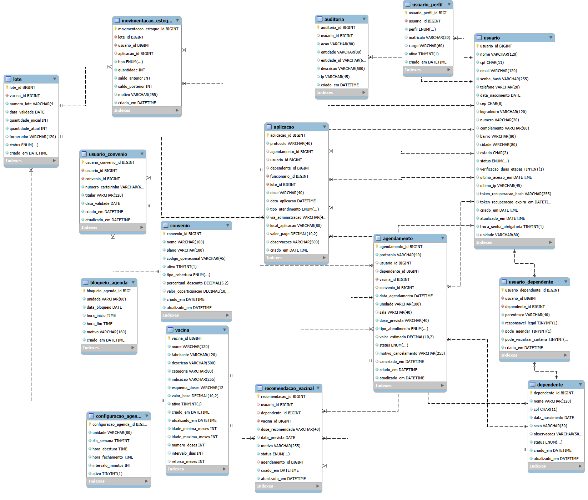

# Orbe Vacinas 

> Projeto acadêmico para a disciplina **Projeto Integrador I**.

## 📖 Sobre o Projeto
O Orbe é um sistema web para gestão de vacinação em clínicas, laboratórios e hospitais. 
O projeto reúne, em uma única aplicação, o cadastro de pacientes, o agendamento de atendimentos, o registro de aplicações, a carteira vacinal e o controle de estoque.

O sistema possui três perfis de acesso:

- **Paciente:** consulta agendamentos, carteira vacinal, dependentes e convênios;
- **Funcionário:** acompanha a agenda diária, realiza check-in, gerencia pacientes e registra aplicações;
- **Administrador:** gerencia usuários, vacinas, lotes, convênios, funcionamento da clínica, relatórios e auditoria.


## ⚙️ Principais Funcionalidades 
- [ ] **Cadastro e autenticação de usuários;** 
- [ ] **Gestão de pacientes e dependentes;** 
- [ ] **Agendamento, reagendamento e cancelamento de vacinas;** 
- [ ] **Atualização automática do estoque após a aplicação;**
- [ ] **Cadastro de vacinas, lotes e convênios;**
- [ ] **Carteira e histórico vacinal;**
- [ ] **Relatórios administrativos e registros de auditoria;**

## 🛠 Tecnologias Utilizadas
Este projeto está sendo construído com a seguinte stack:

* **Front-end:** Svelte 5, TypeScript, Vite, Vitest, CSS c
* **Back-end:** Java 21, Jakarta Servlet 6.1, JDBC, Jackson, Maven, Tomcat 11
* **Banco de Dados:** MySQL

## 🏢 Arquitetura

O front-end e o back-end são aplicações separadas. A comunicação acontece por HTTP, utilizando JSON.

```text
Svelte
  ↓ HTTP/JSON
Filtro de segurança
  ↓
Servlet
  ↓
Service
  ↓
DAO JDBC
  ↓
MySQL
```

No back-end, os Servlets recebem as requisições, os Services executam as regras de negócio e os DAOs concentram os comandos SQL e o acesso ao banco.

## 🗂 Estrutura do projeto

```text
orbe/
├── back_end/
│   ├── src/main/java/br/com/orbe/
│   │   ├── config/
│   │   ├── dao/
│   │   ├── dto/
│   │   ├── exception/
│   │   ├── model/
│   │   ├── service/
│   │   ├── servlet/
│   │   └── util/
│   └── src/main/resources/db/migration/
├── front_end/
│   └── src/
│       ├── design-system/
│       ├── features/
│       ├── layout/
│       ├── lib/
│       └── mocks/
└── docs/
```
## 🗂 Estrutura do Banco de Dados 



